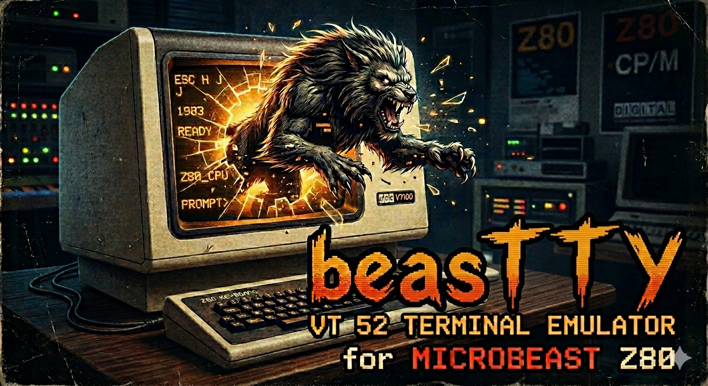
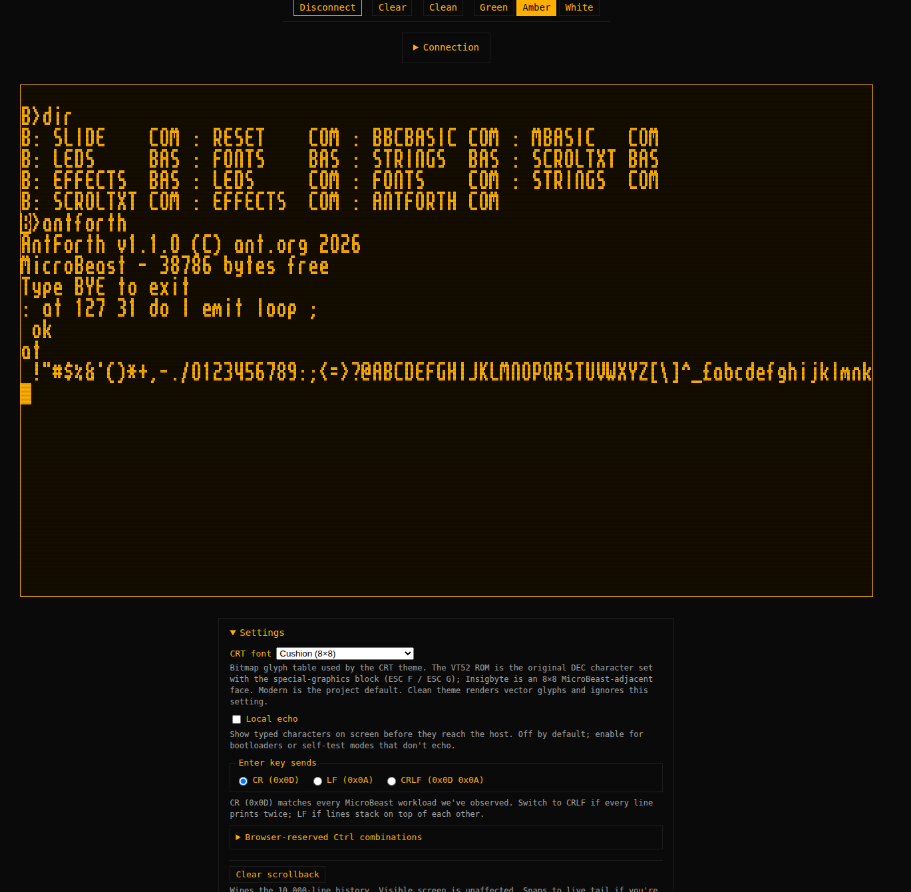
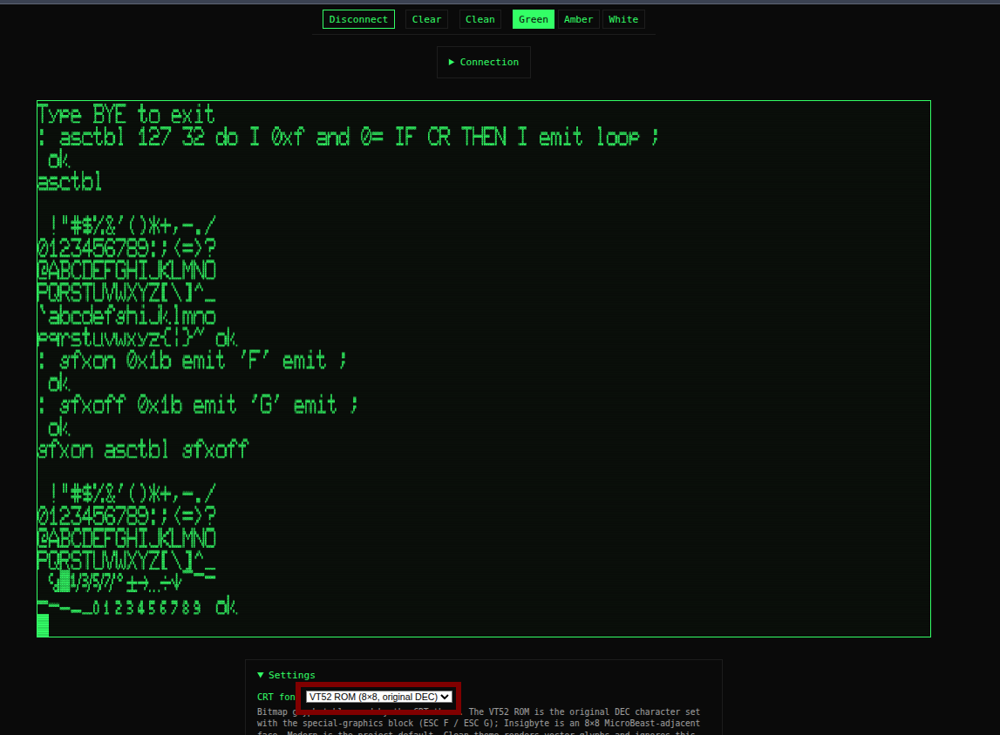

# BeasTTY



A [VT52](https://en.wikipedia.org/wiki/VT52) emulator in the browser, for use with the [Feersum Technology MicroBeast](https://feersumbeasts.com/microbeast.html) z80 retrocomputer.




## How do I use it?

Plug in your retrocomputer then visit https://blowback.github.io/beasTTY/ in  a Chrome-based browser.

## I don't like chrome, can I use $BROWSER?

You may not. Only Chrome supports WebSerial, upon which this TTY is based.

## Display styles

Render a crips modern display with "Clean" or go for a more vintage CRT look with 
"Green", "Amber" or "White".

The special "Graphics Mode" characters are not available in "Clean" mode, which uses 
Jetbrains Mono Regular or falls back to whatever monospaced font is locally available.

## CRT Fonts 

As well as it's own builtin 16x8 font, the TTY includes a version of the original VT52 font, 
including the special "Graphics mode" characters accessible by `ESC F`. This font comes from 
[the fritzm/vt52 github repo](https://github.com/fritzm/vt52).



The fonts Cushion, Insigbyte, and You Square come from the excellent [ZX Origins](https://damieng.com/typography/zx-origins/) 
where there are many many more examples of DamienG's meticulous work. 

## Keyboard shortcuts

All shortcuts are intercepted only when the terminal area has focus. Bare keys
(no modifier listed) encode normally to the host as VT52 bytes — the table only
lists chords and special keys with UI-side meaning.

### UI / clipboard

| Shortcut             | Action                                              |
|----------------------|-----------------------------------------------------|
| Ctrl+Alt+T           | Toggle theme (CRT ↔ Clean)                          |
| Ctrl+= / Ctrl++      | Zoom in (1× → 4×)                                   |
| Ctrl+-               | Zoom out                                            |
| Ctrl+0               | Reset zoom to 1×                                    |
| Ctrl+Shift+C         | Copy current selection to clipboard                 |
| Ctrl+Shift+V         | Paste from clipboard (subject to rate limit)        |
| Ctrl+Shift+Esc       | Clear an established selection                      |


### Scrollback navigation

| Shortcut             | Action                                              |
|----------------------|-----------------------------------------------------|
| Shift+PageUp         | Scroll back one page                                |
| Shift+PageDown       | Scroll forward one page                             |
| Shift+Home           | Jump to oldest scrollback line                      |
| Shift+End            | Snap to live tail (cancel scroll-back)              |


Any keypress that produces an outbound byte while scrolled-back also snaps the
viewport to the live tail before the byte is sent.

### Esc key behaviour

Esc is context-sensitive. The first matching rule wins:


| Context                                 | Effect of Esc                  |
|-----------------------------------------|--------------------------------|
| **Ctrl+Shift+Esc** (any time)           | Clear established selection    |
| Mid-drag (mouse button still down)      | Cancel the in-flight selection |
| Paste pump still running                | Cancel paste                   |
| Otherwise                               | Encode `0x1B` to host          |


### Browser-reserved chords (cannot be intercepted)

Chromium claims `Ctrl+W` (close tab), `Ctrl+N` (new window), `Ctrl+T` (new tab)
and `Ctrl+Shift+T` (reopen closed tab) at the OS layer. Map those control codes
to a different chord on the MicroBeast side if you need them.

## Can I run it locally?

Yes, download the repo then build it:

```
scripts/build.sh
```

then run it with:

```
python3 -m http.server -d www 8000
```


