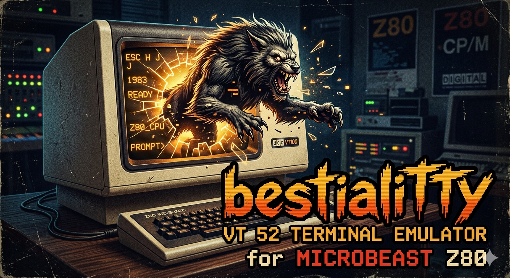

# BestialiTTY

#

A [VT52](https://en.wikipedia.org/wiki/VT52) emulator in the browser, for use with the [Feersum Technology MicroBeast](https://feersumbeasts.com/microbeast.html) z80 retrocomputer.

Fun police: The name is a terrible pun! It's a *TTY* for the Micro*Beast* -- geddit? 

#

## Display styles

Render a crips modern display with "Clean" or go for a more vintage CRT look with 
"Green", "Amber" or "White".

The special "Graphics Mode" characters are not available in "Clean" mode, which uses 
Jetbrains Mono Regular or falls back to whatever monospaced font is locally available.

## CRT Fonts 

As well as it's own builtin 16x8 font, the TTY includes a version of the original VT52 font, 
including the special "Graphics mode" characters accessible by `ESC F`. This font comes from 
[the fritzm/vt52 github repo](https://github.com/fritzm/vt52).

The fonts Cushion, Insigbyte, and You Square come from the excellent [ZX Origins](https://damieng.com/typography/zx-origins/) 
where there are many many more examples of DamienG's meticulous work. 

