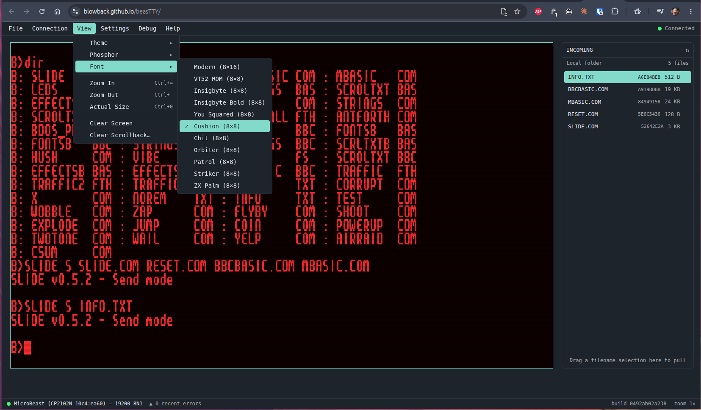
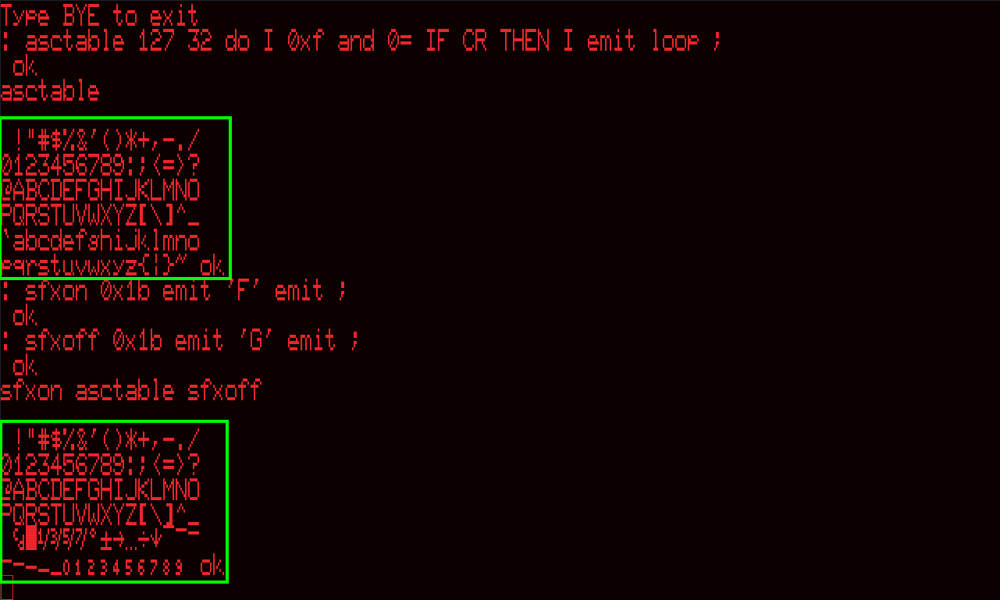
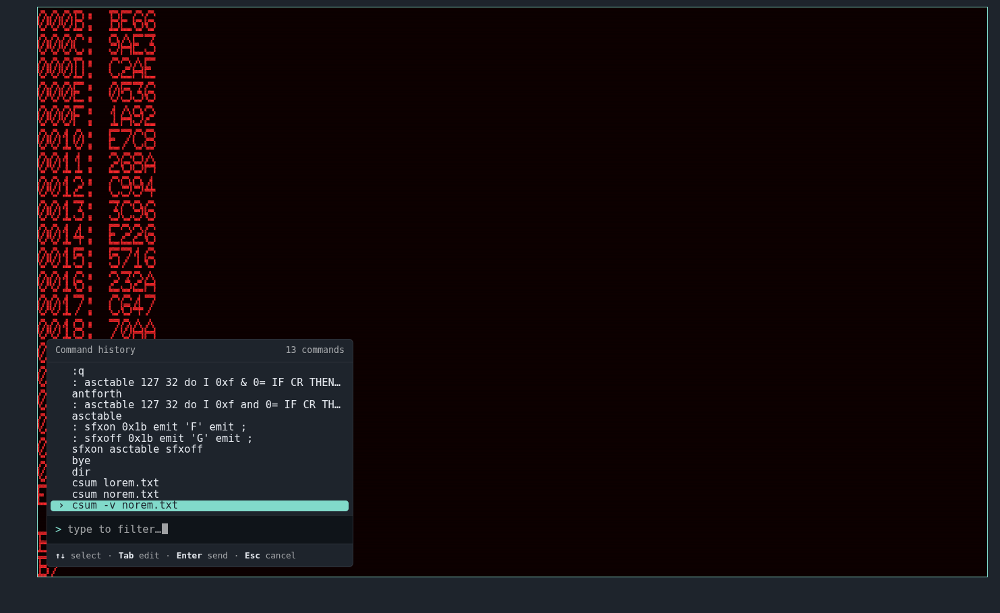
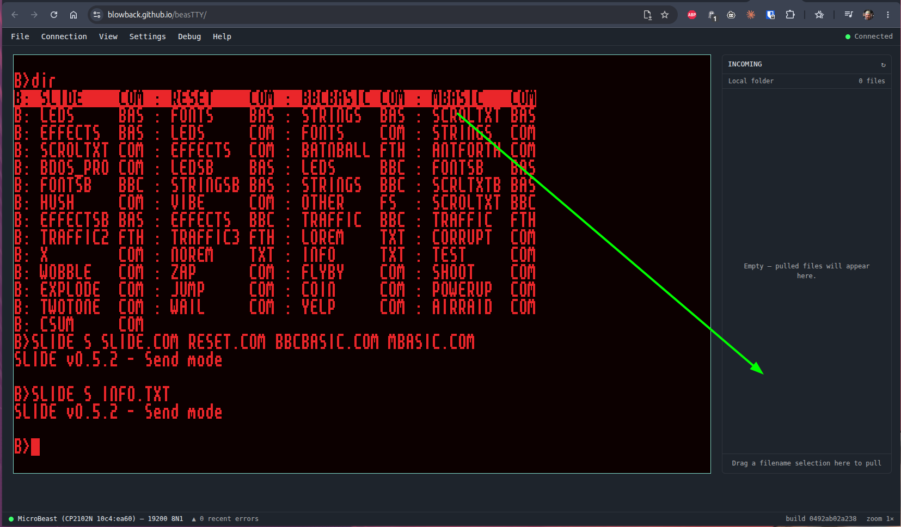
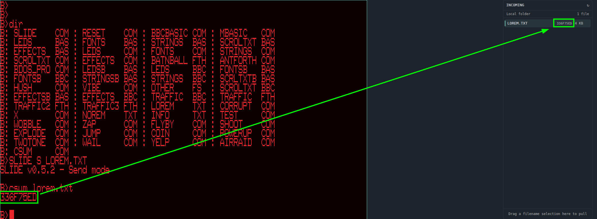
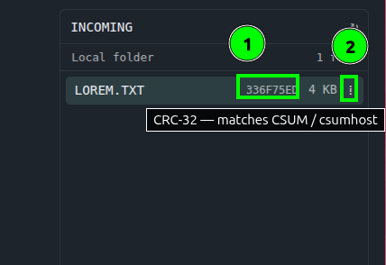
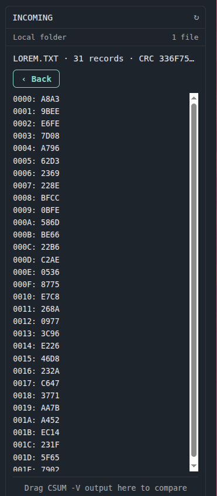
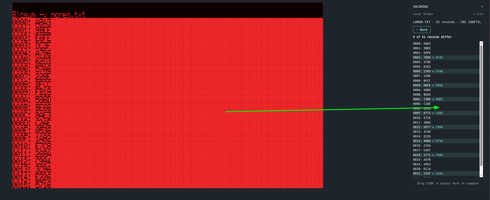

# BeasTTY


A [VT52](https://en.wikipedia.org/wiki/VT52) emulator in the browser, for use with the [Feersum Technology MicroBeast](https://feersumbeasts.com/microbeast.html) z80 retrocomputer.




## How do I use it?

Plug in your retrocomputer then visit https://blowback.github.io/beasTTY/ in  a Chrome-based browser. 
Click "Connect" from the menu at the top, select your MicroBeast USB port, and off you go.

## I don't like chrome, can I use $BROWSER?

You may not. Only Chrome supports WebSerial, upon which this TTY is based.

## Display styles

Render a crisp modern display with "Clean" or go for a more vintage CRT look with 
"Green", "Amber", "White", "Blue" or "Red".

The special "Graphics Mode" characters are not available in "Clean" mode, which uses 
Jetbrains Mono Regular or falls back to whatever monospaced font is locally available.

## CRT Fonts 

As well as it's own builtin 16x8 font, the TTY includes a version of the original VT52 font, 
including the special "Graphics mode" characters accessible by `ESC F`. This font comes from 
[the fritzm/vt52 github repo](https://github.com/fritzm/vt52).



The fonts Cushion, Insigbyte, You Squared, Chit, Orbiter, Patrol, Striker and ZX Palm all 
come from the excellent [ZX Origins](https://damieng.com/typography/zx-origins/) 
where there are many many more examples of DamienG's meticulous work. 

## Keyboard shortcuts

All shortcuts are intercepted only when the terminal area has focus. Bare keys
(no modifier listed) encode normally to the host as VT52 bytes — the table only
lists chords and special keys with UI-side meaning.

### UI / clipboard

| Shortcut             | Action                                              |
|----------------------|-----------------------------------------------------|
| Ctrl+Alt+T           | Toggle theme (CRT ↔ Clean)                          |
| Ctrl+= / Ctrl++      | Zoom in (1× → 4×)                                   |
| Ctrl+-               | Zoom out                                            |
| Ctrl+0               | Reset zoom to 1×                                    |
| Ctrl+Shift+C         | Copy current selection to clipboard                 |
| Ctrl+Shift+V         | Paste from clipboard (subject to rate limit)        |
| Ctrl+Shift+Esc       | Clear an established selection                      |
| Drag files onto canvas        | Open SLIDE send modal for the dropped files |
| Click ↑ Send file (top bar)   | Open file picker for SLIDE send             |
| Esc (during SLIDE transfer)   | Cancel the in-flight SLIDE send or receive  |


### Scrollback navigation

| Shortcut             | Action                                              |
|----------------------|-----------------------------------------------------|
| Shift+PageUp         | Scroll back one page                                |
| Shift+PageDown       | Scroll forward one page                             |
| Shift+Home           | Jump to oldest scrollback line                      |
| Shift+End            | Snap to live tail (cancel scroll-back)              |


Any keypress that produces an outbound byte while scrolled-back also snaps the
viewport to the live tail before the byte is sent.

### Command line history

| Shortcut             | Action                                              |
|----------------------|-----------------------------------------------------|
| Up / Down            | Activate command line history                                |
| Enter                | Send the selected command immediately  |
| TAB                  | Edit the selected command before sending                      |
| Esc            | Dismiss the command line history popup              |




### Esc key behaviour

Esc is context-sensitive. The first matching rule wins:


| Context                                 | Effect of Esc                  |
|-----------------------------------------|--------------------------------|
| **Ctrl+Shift+Esc** (any time)           | Clear established selection    |
| Mid-drag (mouse button still down)      | Cancel the in-flight selection |
| Paste pump still running                | Cancel paste                   |
| Otherwise                               | Encode `0x1B` to host          |


### Browser-reserved chords (cannot be intercepted)

Chromium claims `Ctrl+W` (close tab), `Ctrl+N` (new window), `Ctrl+T` (new tab)
and `Ctrl+Shift+T` (reopen closed tab) at the OS layer. Map those control codes
to a different chord on the MicroBeast side if you need them.

## File transfer (SLIDE)

BeasTTY supports the SLIDE protocol for sending and receiving files between
your computer and the MicroBeast.

### Sending files (PC → Z80)

Drag files onto the terminal area, or click the `↑ Send file` button in the
top menu. The send modal previews each filename rewritten to CP/M 8.3 form,
and lets you confirm or cancel the batch before the transfer starts.

If two or more files would collide on the Z80 side after 8.3 truncation
(case-insensitive), the modal shows a per-collision-group preview of the
auto-rename scheme (`REPORT.TXT, REPORT~1.TXT, REPORT~2.TXT, …`) and offers
three resolutions: `Send N renamed`, `Send only first`, or `Refuse batch`.

By default BeasTTY auto-types `A:SLIDE.COM R\r` at the Z80 prompt before the
transfer to put the Z80 into receive mode. Tell BeasTTY where SLIDE.COM lives
in Settings → SLIDE file transfer and it appends the direction letter itself —
`R` here, `S` when the pull pane asks for files — so one setting serves both
directions.

### Receiving files (Z80 → PC)

When the Z80 sends a file via `A:SLIDE.COM S FILE.TXT`, BeasTTY auto-detects the
SLIDE wakeup signature (`ESC ^ S L I D E`) and downloads each file via your
browser's Downloads tray. Settings → SLIDE file transfer lets you optionally
save received files to a chosen folder instead.

You can also drag filenames from the terminal pane into the filer pane to 
automatically transfer files from the MicroBeast to your local PC. 



**NB** you can't drag directly to a filer window, you'll just get a new file 
with all the selected filenames in it!

### Beast to beast (two MicroBeasts, two tabs)

If you run two MicroBeasts, open a BeasTTY tab for each and you can copy a
file straight from one to the other: select a filename in one beast's
terminal and drop it on the other beast's terminal. The source beast pulls
the file into its own pull folder, hands the bytes to the other tab, and the
destination beast receives them — one gesture instead of a pull, a folder and
a send. Nothing leaves your browser; the two tabs talk to each other directly.

Beast-to-beast drag needs both BeasTTY tabs visible at once — use Chrome's
Split View to put them side by side.

Both tabs need their own serial port, and the source tab needs a pull folder
chosen in its filer pane. If anything is missing you get a plain sentence
saying which one thing to fix, not a silent failure.

### Cancelling

Press `Esc`, or click `[Cancel]` on the floating SLIDE chip, to abort an
in-flight send or receive. The wire returns to a clean CP/M prompt.

### Checksums

You can generate checksums on the MicroBeast side using my [CSUM](https://github.com/blowback/csum) utility,
and compare them with the automatically generated equivalents in BeasTTY'starts
filer pane:



Hover over the checksum until the disclosure icon appears:



Click on the disclosure icon to get the multi-block checksum for the file, 
equivalent to typing `csum -v ...` on the MicroBeast:



Drag a `csum -v ...` output from the MicroBeast onto that window to compare
it with the local file, block by block:




### Working with legacy `slide.com` (no wakeup)

Detection of inbound transfers and the auto-typed-command handshake both
rely on a small patch to the Z80-side `slide.asm` that emits the 7-byte
`ESC ^ S L I D E` wakeup signature when SLIDE starts up. `slide.com` versions 
0.5.0 and upwards have this support built in.

To use BeasTTY with an unpatched `slide.com`:

- **Sending (PC → Z80):** after BeasTTY auto-types the start command
  (`A:SLIDE.COM R\r` by default), it waits ~3 s for the wakeup. If nothing arrives, the SLIDE chip switches to
  `Z80 didn't respond.  [Retry]  [Cancel]  [Force start]`. Click
  **`[Force start]`** to skip the wakeup wait and begin the transfer
  anyway — `slide.com`'s receive handshake still works without the
  signature, you just lose the auto-detection safety net.
- **Receiving (Z80 → PC):** without the wakeup, BeasTTY can't tell that a
  SLIDE session is starting, so the inbound bytes hit the terminal parser
  as garbled output. There is no in-app workaround — you need the patched
  `slide.asm` for inbound transfers to work.

If you'd rather make the chip's behaviour explicit (instead of falling
into the 3 s timeout each time), set **Compatibility mode** in
Settings → SLIDE file transfer:

- **Auto** *(default)* — wait 3 s for the wakeup, then prompt with
  `[Retry] [Cancel] [Force start]`. Best when you sometimes use a patched
  Z80 and sometimes don't.
- **Wakeup-required** — wait indefinitely for the wakeup signature; never
  time out. Best when you've patched `slide.com` and want to be told
  loudly if the patch isn't loaded.
- **Force-start (legacy slide.com)** — skip the wakeup wait entirely;
  jump straight into the transfer the moment auto-type finishes. Best
  when you're knowingly running stock upstream `slide.com`.

### Settings → SLIDE file transfer

The SLIDE sub-block in the Settings pane covers four prefs. All persist in
`localStorage`.

- **Save received files to a chosen folder** *(off by default)* — when
  on, BeasTTY asks once for a target directory via the File System Access
  API and writes each subsequent received file there silently, instead of
  pushing one download per file through the browser's Downloads tray.
  Off, you get an anchor-click download per file (with a small inter-file
  gap so Chrome's multi-download throttle doesn't fire).
- **SLIDE.COM location** *(default `A:` + `SLIDE.COM`)* — a drive
  dropdown and the program name, saying where SLIDE lives on the device.
  BeasTTY appends the direction letter and the Enter itself: `R` to put
  the Z80 into receive mode before a host-initiated send, `S` when the
  pull pane asks the Z80 for files. Stating it once is what keeps the two
  directions consistent — before this, pulls used a bare `SLIDE S` and
  CP/M answered `SLIDE?` from any drive that wasn't the one holding
  SLIDE.COM. The `.COM` is optional (`SLIDE` works too), and the name need
  not be SLIDE at all: BeasTTY transfers files with SLIDE specifically, so
  this names *that* binary — rename it to `BANANA.COM` and put that here,
  and it still speaks the protocol and still takes `R`/`S`. (For any other
  transfer program — XMODEM, YMODEM, KERMIT — you drive the MicroBeast by
  hand.) The name is validated as a CP/M 8.3 filename; anything else is
  rejected at use time
  with a `Not a CP/M 8.3 program name — SLIDE won't start.` hint, and
  nothing is typed at the prompt.
- **Auto-start SLIDE on the device** *(default on)* — when off, BeasTTY
  types nothing before a send and you start `slide.com` on the MicroBeast
  yourself. The location above still composes the pull command, so
  dragging files out of the pull pane keeps working either way.
- **Show transfer summary chip** *(default on)* — when on, a small chip
  appears for ~5 s after a successful send or receive completes,
  reporting the file count, total bytes, and direction
  (`Sent 3 files — 12.4 KB → MicroBeast` for sends,
  `Received 2 files — 8.7 KB` for receives). Turn it off if you find the
  post-transfer chip distracting; the chip *for cancelled transfers*
  always shows regardless (`Cancelled — N of M files transferred`), so
  you'll never silently lose feedback that a cancel actually took effect.
- **Compatibility mode** *(default `Auto`)* — see "Working with legacy
  `slide.com`" above.

## Can I run it locally?

Yes, download the repo then build it:

```
scripts/build.sh
```

then run it with:

```
python3 -m http.server -d www 8000
```


